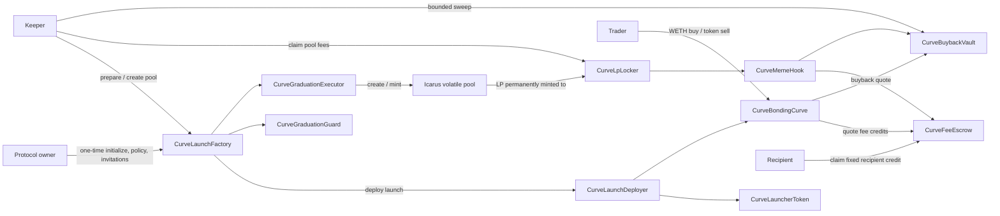
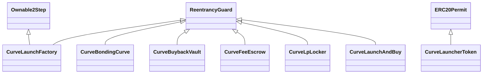

# Curveball V2 security and call surface

Status: V2 deployed on RISE Testnet and source-verified, 2026-09-30. Database and app cutover are pending.

## Deployment and authority

The factory owns launch policy and invitation control. Creators have no mint, reserve, fee policy, or graduation authority. Its one-time `initialize` verifies every service's factory/quote/venue binding, then binds locker and fee authorizations. Deployment uses separate transactions because embedding every service creation in the factory constructor exceeded EIP-3860's 49,152-byte creation-code limit. `make -C contracts test` enforces that limit and EIP-170's 24,576-byte runtime limit for all V2 contracts.

## Lifecycle and custody

```mermaid
stateDiagram-v2
  [*] --> Trading: LaunchCreated
  Trading --> Ready: sold out; anyone calls graduate
  Ready --> Trading: a holder sells
  Ready --> Graduated: anyone calls createGraduatedPool
  Graduated --> [*]
```

The implementation deliberately keeps quote and unsold token reserves in the curve while `Ready`. The approved design proposed draining them to the factory in `graduate()`. Retaining them keeps seller exits available and removes a second reserve custodian. `createGraduatedPool()` validates Icarus and transfers both assets atomically; a revert leaves the curve funded and retryable. The token transfer lock opens in that same transaction and rolls back if pool creation fails.

The guard rejects paused, noncanonical, nonempty, or underfunded pools. When preparation preflight fails, `graduate()` emits `GraduationDeferred` and leaves the market trading; the SDK decodes that event and the UI reports the deferral. Pool creation still reverts atomically on failure. The executor verifies the returned pool's token pair before transferring reserves. LP is minted directly to `CurveLpLocker`; its rescue path refuses registered LP tokens. Existing V1 `LpLocker` remains for old markets and tests.

## Fee and buyback invariants

- Each launch snapshots fee, creator share, buyback share, creator tax, and treasury. Default curve fee is 50 bps, split 50% creator, 25% buyback, 25% protocol. Creator tax defaults to zero and is capped at 50 bps.
- Buys and sells charge fees on the quote leg. `CurveFeeEscrow` and `CurveBuybackVault` require asset backing before crediting liabilities. Claims are permissionless but always pay the recorded recipient.
- Icarus pool fees are claimed by the LP locker, measured as actual balance deltas, and routed in kind through `CurveMemeHook`. There is no Icarus after-swap hook registry.
- Buybacks are restricted to their own curve or own Icarus pool, a 30-minute price reference, 5% spot deviation, and 2% impact bound. Each acquired token lot vests independently over five years; only the current protocol owner can claim the vested portion.
- `nonReentrant` protects trading, graduation, claims, and sweeps. Slither's `reentrancy-balance` finding on `sweepPool()` concerns the intended before/after token balance measurement around the canonical Icarus swap; the reentrancy guard blocks nested sweeps. Slither's `divide-before-multiply` on quote calculations reflects conservative integer rounding; the exact spend and reserve backing are tested. These findings should be reconsidered if the quote asset or Icarus implementation changes.
- Current protocol ownership can recover unsolicited ERC-20 and native balances. The curve reserves `realQuote` and unsold tokens, the escrow reserves all credited liabilities, and the vault reserves quote liabilities and unvested meme balances. The locker refuses registered LP tokens. Rescues emit indexed events; owner changes follow the factory's two-step ownership transfer. A malicious quote callback test verifies the curve's reentrancy guard blocks a nested buy.

## Verification evidence

The V2 suites cover launch snapshots, invitations, fixed supply, buy/sell solvency, fee conservation, escrow claims, guarded recovery, callback reentrancy, independent vesting lots, bounded sweeps, two-step graduation failures and retries, wrong pool identity, LP custody, in-kind fees, and atomic launch-and-buy. Foundry's 256-run stateful trade fuzz test checks S1/S2/S3/S6/S8 after every step. Echidna's `echidna-v2.yaml` executes S1–S8 over 20,000 calls, including donation recovery and a separate creator's attempted admin calls. The strict RISE Testnet fork exercises launch through post-graduation swap, fee claim, and pool buyback. A separate local Anvil test deploys every service and drives the wallet SDK through launch, trade, curve sweep, graduation, and claim. The isolated database suite indexes pool registration, deferral, and recovery events as well as trades and fees. The SDK retries a simulation at most twice when a recently confirmed allowance approval is briefly absent from a lagging RPC response; unit tests reproduce this condition.

Remaining external verification: the separately approved database migration, V2 app cutover, and live API/indexer smoke test. All nine Testnet contracts are source-verified on Blockscout. No mainnet V2 deployment is authorized by this work.
